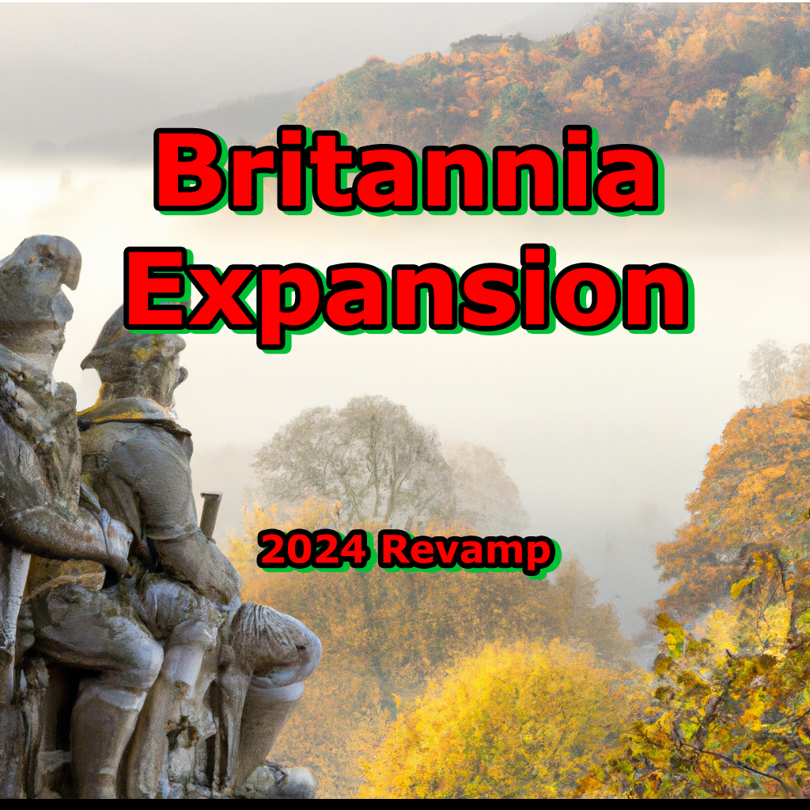

<!-- PROJECT LOGO -->
<br />
<div align="center">
  <a href="https://github.com/aerh3f01/Britannia_CK3_Revival">
    
  </a>

<h3 align="center">Britannia Expansion: CK3 Revival</h3>
  <div id="subscribe">
    <a href="https://steamcommunity.com/sharedfiles/filedetails/?id=2979045549">
      
    </a>
  </div>
  <div id="badges">
    
    
    
    
  </div>

  <h2>🏴󠁧󠁢󠁷󠁬󠁳󠁿 2025 CONTINUATION 🏴󠁧󠁢󠁷󠁬󠁳󠁿</h2>
  <p>
    <strong>Reviving and expanding this comprehensive Britannia mod for Crusader Kings 3!
    </strong>
    <br />
    Major updates planned throughout 2025 with focus on authentic Welsh culture and historical accuracy.
  </p>
    
  <p align="justified">
    <strong>Britannia Expansion</strong> is a comprehensive cultural and historical enhancement mod for Crusader Kings 3, focusing on the rich heritage of the British Isles. Starting with an in-depth expansion of Welsh culture, the mod aims to provide authentic historical experiences through custom events, decisions, characters, and cultural mechanics that bring the medieval Celtic kingdoms to life.
  </p>
    
  <p>
    <a href="#features"><strong>🎯 View Features »</strong></a>
    ·
    <a href="roadmap.md"><strong>🗺️ Development Roadmap »</strong></a>
    ·
    <a href="https://github.com/aerh3f01/Britannia_CK3_Revival/issues"><strong>🐛 Report Issues »</strong></a>
    ·
    <a href="#contributing"><strong>🤝 Contribute »</strong></a>
  </p>
</div>

---

<!-- TABLE OF CONTENTS -->
<details open>
  <summary><h2>📋 Table of Contents</h2></summary>
  <ol>
    <li><a href="#about-the-project">About The Project</a></li>
    <li><a href="#features">Current Features</a></li>
    <li><a href="#installation">Installation</a></li>
    <li><a href="#welsh-focus">Welsh Culture Focus</a></li>
    <li><a href="#roadmap">Development Roadmap</a></li>
    <li><a href="#file-structure">Mod Structure</a></li>
    <li><a href="#documentation">Documentation</a></li>
    <li><a href="#contributing">Contributing</a></li>
    <li><a href="#compatibility">Compatibility</a></li>
    <li><a href="#acknowledgments">Acknowledgments</a></li>
   </ol>
</details>
---

## 📖 About The Project

**Britannia Expansion** transforms the experience of playing as Celtic rulers in Crusader Kings 3 by adding historical depth, cultural authenticity, and engaging gameplay mechanics focused on the British Isles. The mod currently centers on Welsh culture and kingdoms, with planned expansions to Scotland, Ireland, and England.

### 🎯 Project Goals

- **Historical Authenticity**: Accurate representation of medieval Welsh culture, politics, and society
- **Immersive Gameplay**: Custom events and decisions that reflect the unique challenges of Welsh rulers
- **Cultural Depth**: Enhanced court positions, religious elements, and social structures
- **Dynamic Storytelling**: Event chains that capture the spirit of Welsh resistance and independence

---

## ✨ Features

### 🏴󠁧󠁢󠁷󠁬󠁳󠁿 Welsh Culture Enhancement

- **Custom Kingdom Formation**: Unique mechanics for uniting Wales under a single crown
- **Historical Events**:
  - Norman invasion resistance (1067-1093)
  - Welsh uprising of 1136
  - Power struggles between Welsh princes
  - Owain Gwynedd's rise to power
- **Religious Decisions**:
  - Canonization of St. David
  - Appointing "David the Scot" as Bishop of Bangor
  - Moving Saint Dubricius' remains to Llandaff
- **Court Positions**: Welsh-specific court roles and cultural mechanics
- **Custom Bookmarks**: Enhanced 1066 start with detailed Welsh characters

### 🎭 Characters & Events

- **Historical Figures**: Accurately portrayed Welsh rulers and nobles
- **Dynamic Events**: Court intrigue, religious ceremonies, and political maneuvering
- **Cultural Struggles**: Unique struggle mechanics for Welsh independence

### 🏰 Territorial Features

- **Custom Titles**: Historically accurate Welsh kingdoms and duchies
- **Coat of Arms**: Authentic Welsh heraldry and symbols
- **Geographic Regions**: Properly defined Welsh cultural areas

---

## 🚀 Installation

### Steam Workshop (Recommended)

1. Subscribe to the mod on [Steam Workshop](https://steamcommunity.com/sharedfiles/filedetails/?id=2979045549)
2. Launch Crusader Kings 3
3. Enable "Britannia Expansion" in the mod manager
4. Start a new game to experience the enhanced content

### Manual Installation

1. Download the latest release from the [GitHub repository](https://github.com/aerh3f01/Britannia_CK3_Revival/releases)
2. Extract to your CK3 mod folder:
   - **Windows**: `%USERPROFILE%\Documents\Paradox Interactive\Crusader Kings III\mod\`
   - **Linux**: `~/.local/share/Paradox Interactive/Crusader Kings III/mod/`
   - **Mac**: `~/Documents/Paradox Interactive/Crusader Kings III/mod/`
3. Enable the mod in the CK3 launcher

---

## 🏴󠁧󠁢󠁷󠁬󠁳󠁿 Welsh Culture Focus

### Historical Context

The mod focuses on the period from 1066 onwards, capturing the tumultuous era when Welsh kingdoms faced Norman expansion while struggling to maintain their independence and cultural identity.

### Key Welsh Features

#### 🏛️ Kingdom Formation

- **Reunification Mechanics**: Special decisions to unite fractured Welsh kingdoms
- **Cultural Requirements**: Authentic prerequisites based on Welsh heritage
- **Dynamic AI Behavior**: Enhanced AI decision-making for Welsh rulers

#### ⛪ Religious Elements

- **Celtic Christianity**: Unique religious practices and traditions
- **Saint Veneration**: Historical Welsh saints and their cultural impact
- **Monastic Traditions**: Welsh-specific religious institutions

#### 🎖️ Court Culture

- **Bards and Poets**: Cultural court positions reflecting Welsh literary tradition
- **Clan Dynamics**: Family and tribal relationship mechanics
- **Honor System**: Welsh concepts of honor and hospitality

#### 🗡️ Historical Events

- **Norman Resistance**: Events depicting Welsh resistance to Norman conquest
- **Inter-Welsh Conflicts**: Realistic portrayal of conflicts between Welsh kingdoms
- **English Relations**: Complex diplomatic and military interactions with England

---

## 🗺️ Development Roadmap

For detailed development plans, see our comprehensive [Roadmap](roadmap.md).

### Current Phase: Welsh Enhancement (v1.x)

- ✅ Basic Welsh kingdom mechanics
- 🔄 **In Progress**: Enhanced events and decisions
- 📋 **Planned**: Character refinement and court culture

### Future Phases

- **Phase 2**: Scottish expansion
- **Phase 3**: Irish enhancement
- **Phase 4**: English refinement

---

## 📁 Mod Structure

```
Britannia Expansion/
├── common/                     # Core game mechanics
│   ├── bookmark_portraits/     # Character portraits for bookmarks
│   ├── bookmarks/             # Custom start dates and scenarios
│   ├── coat_of_arms/          # Welsh heraldry and symbols
│   ├── court_positions/       # Welsh-specific court roles
│   ├── decisions/             # Major and minor decisions
│   ├── landed_titles/         # Welsh kingdoms and titles
│   ├── scripted_effects/      # Reusable game effects
│   ├── scripted_triggers/     # Conditional logic
│   └── struggle/              # Welsh independence struggle
├── events/                    # Event files
│   ├── be_canonization_events.txt
│   └── be_welsh_kingdom_events.txt
├── history/                   # Historical setup
│   ├── characters/            # Historical Welsh figures
│   ├── cultures/              # Welsh culture definitions
│   └── titles/                # Title history
├── localization/              # Text and translations
│   └── replace/english/       # English localization files
└── gfx/                      # Graphics and visual assets
    ├── coat_of_arms/
    ├── interface/
    └── portraits/
```

---

## 📖 Documentation

### **Core Documentation**

- **[🗺️ Development Roadmap](roadmap.md)** - Detailed development timeline and feature planning
- **[🏴󠁧󠁢󠁷󠁬󠁳󠁿 Welsh Culture Guide](WELSH_CULTURE_GUIDE.md)** - Comprehensive guide to Welsh cultural elements
- **[🏰 Welsh Historical Events](WELSH_HISTORICAL_EVENTS.md)** - Timeline of key events for CK3 implementation (867-1453)
- **[👑 Welsh Historical Characters](WELSH_CHARACTERS.md)** - Database of historical figures for mod implementation
- **[🔧 Technical Guide](TECHNICAL_GUIDE.md)** - Development standards and CK3 implementation details
- **[📝 Contributing Guidelines](CONTRIBUTING.md)** - Guidelines for community contributions

### **Additional Resources**

- **[📋 Changelog](CHANGELOG.md)** - Version history and update tracking
- **[❓ FAQ](FAQ.md)** - Frequently asked questions _(Coming Soon)_
- **[🎯 Known Issues](KNOWN_ISSUES.md)** - Current bugs and limitations _(Coming Soon)_

---

## 🤝 Contributing

We welcome contributions from the community! Here's how you can help:

### 🐛 Bug Reports

- Use the [GitHub Issues](https://github.com/aerh3f01/Britannia_CK3_Revival/issues) page
- Include your CK3 version, mod version, and detailed description
- Attach save files if possible

### 💡 Feature Suggestions

- Propose new features through GitHub Issues
- Focus on historical accuracy and gameplay enhancement
- Provide historical sources when possible

### 🔧 Code Contributions

1. Fork the repository
2. Create a feature branch (`git checkout -b feature/AmazingFeature`)
3. Commit your changes (`git commit -m 'Add some AmazingFeature'`)
4. Push to the branch (`git push origin feature/AmazingFeature`)
5. Open a Pull Request

### 📚 Historical Research

- Help verify historical accuracy
- Provide sources for events and characters
- Suggest authentic medieval Welsh practices

---

## 🔗 Compatibility

### ✅ Compatible With

- **CK3 Version**: 1.9._._
- **Ironman Mode**: Full compatibility
- **Achievements**: Most achievements remain available
- **Other Mods**: Generally compatible with graphics and UI mods

### ⚠️ Known Issues

- May conflict with other culture overhaul mods
- Some total conversion mods may cause issues
- Report compatibility problems via GitHub Issues

### 🔄 Save Game Compatibility

- **New Saves**: Recommended for full experience
- **Existing Saves**: Generally compatible, some features may not appear
- **Mod Updates**: Most updates are save-compatible

---

## 🙏 Acknowledgments

### Historical Sources

- **Primary Sources**: Welsh chronicles, Brut y Tywysogion, Mabinogion
- **Academic Works**: Works by John Edward Lloyd, R.R. Davies, and Kari Maund
- **Archaeological Evidence**: Recent findings on medieval Welsh culture

### Community

- CK3 Modding Community for tools and resources
- Welsh History Society for cultural consultation
- Beta testers and feedback providers
- Steam Workshop subscribers for ongoing support

### Technical

- [CK3 Modding Documentation](https://ck3.paradoxwikis.com/Modding)
- Paradox Interactive for Crusader Kings 3
- Community modding tools and resources

---

<div align="center">
  <p><strong>Made with ❤️ for the Welsh gaming community</strong></p>
  <p>
    <a href="https://steamcommunity.com/sharedfiles/filedetails/?id=2979045549">Steam Workshop</a> •
    <a href="roadmap.md">Roadmap</a> •
    <a href="https://github.com/aerh3f01/Britannia_CK3_Revival/issues">Issues</a> •
    <a href="https://github.com/aerh3f01/Britannia_CK3_Revival/discussions">Discussions</a>
  </p>
</div>
