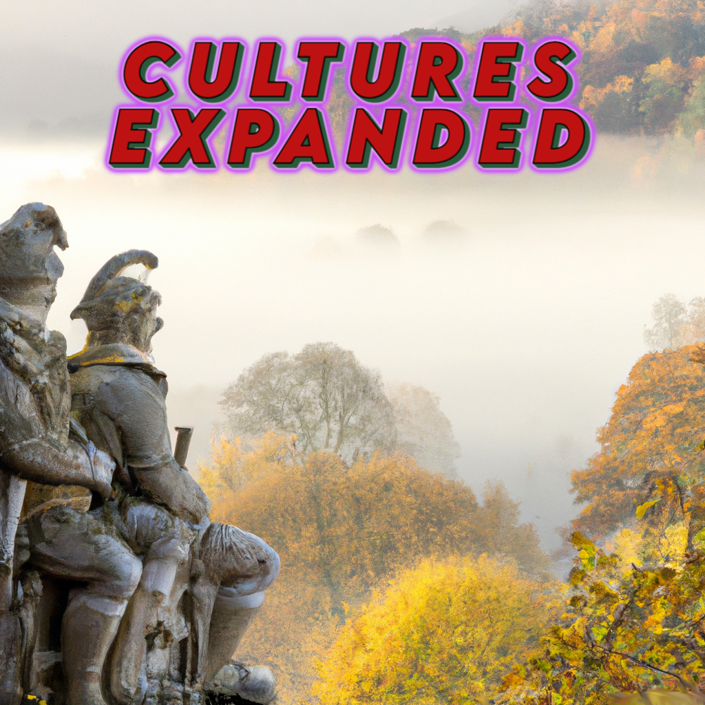

<!-- PROJECT LOGO -->
 

  

<h3 align="center">Britannia Expansion</h3>
  

    
  

    
    
    
  

  

    A small scale culture expansion mod to the UK so far. Looking to update Wales, Scotland, Ireland and England with culture, decisions, characters and events to make a more enhanced experience through the years.
     
    <a href="https://github.com/LordNapoleon/Brittania-expansion-Ck3/tree/main/CulturesExpanded"><strong>Explore the mod! »</strong></a>
     
     
    <a href="https://github.com/LordNapoleon/Brittania-expansion-Ck3/issues">Report Bug</a>
  

<!-- TABLE OF CONTENTS -->

  
Table of Contents

  <ol>
    <li><a href="#about-the-project">About The Project</a></li>
    <li><a href="https://github.com/LordNapoleon/Brittania-expansion-Ck3/blob/main/roadmap.md">Roadmap</a></li>
   </ol>

