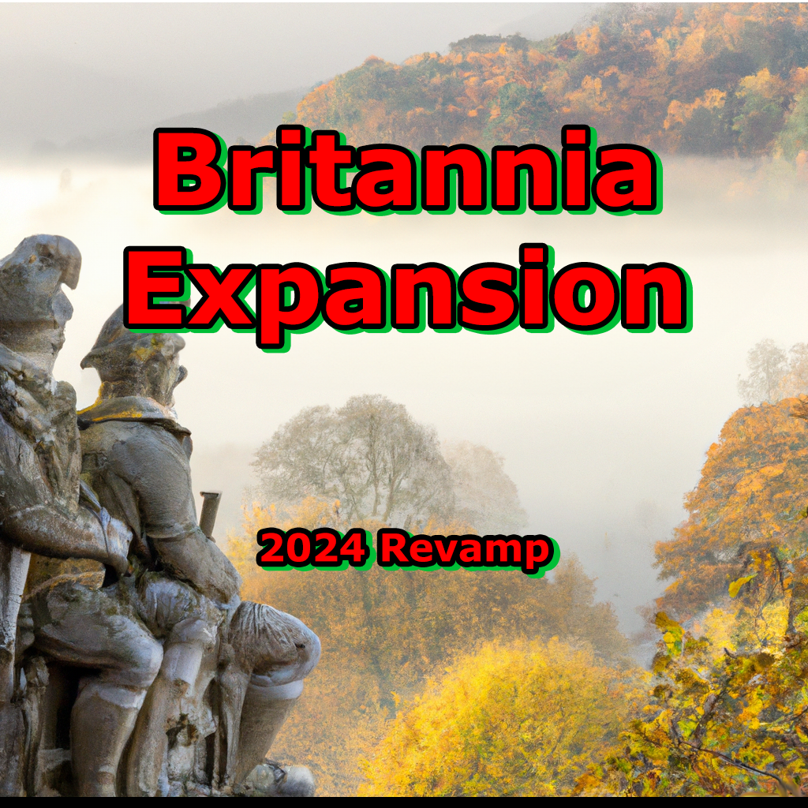

  

# 🗺️ Britannia Expansion Development Roadmap

*Comprehensive development plan for the Welsh-focused CK3 modification*

---

## 📋 Overview

This roadmap outlines the development phases for **Britannia Expansion**, a comprehensive Crusader Kings 3 mod focused on enhancing the Celtic experience in medieval Britain. Our primary focus is creating an authentic and engaging Welsh cultural experience before expanding to other British cultures.

### 🎯 Core Philosophy
- **Historical Authenticity**: Every feature grounded in historical evidence
- **Cultural Depth**: Rich representation of Welsh traditions and society
- **Gameplay Enhancement**: Meaningful choices that reflect medieval Welsh challenges
- **Community Collaboration**: Development guided by historical expertise and player feedback

---

## 📅 Development Timeline

| Version | Focus Area | Status | Target Completion |
|---------|------------|--------|-------------------|
| **1.0** | 🏴󠁧󠁢󠁷󠁬󠁳󠁿 Welsh Foundation | ✅ **Complete** | Released |
| **1.1** | 🎭 Welsh Events & Conflicts | 🔄 **In Progress** | Q2 2025 |
| **1.2** | 🏰 Welsh Decisions & Kingdom | 📋 **Planned** | Q3 2025 |
| **1.3** | 👥 Welsh Characters & Court | 📋 **Planned** | Q4 2025 |
| **2.0** | 🏴󠁧󠁢󠁳󠁣󠁴󠁿 Scottish Expansion | 🔮 **Future** | 2026 |
| **3.0** | 🇮🇪 Irish Enhancement | 🔮 **Future** | 2026 |
| **4.0** | 🏴󠁧󠁢󠁥󠁮󠁧󠁿 English Refinement | 🔮 **Future** | 2027 |

---

## 🏴󠁧󠁢󠁷󠁬󠁳󠁿 Phase 1: Welsh Cultural Foundation

### Version 1.0 - Foundation ✅ **COMPLETE**
*Basic Welsh kingdom mechanics and cultural framework*

#### ✅ **Implemented Features**
- **Kingdom of Gwynedd**: Custom kingdom with historical capitals and structure
- **Basic Titles**: Welsh duchies and counties with accurate territorial divisions
- **Cultural Framework**: Welsh culture group with Brythonic heritage
- **Court Positions**: Initial Welsh-specific court roles
- **Coat of Arms**: Basic Welsh heraldic designs
- **Struggle System**: Foundation for Welsh independence mechanics

---

## 🎭 Phase 1.1: Events & Historical Conflicts

### Version 1.1 - Welsh Events & Resistance 🔄 **IN PROGRESS**
*Focus: Norman invasion period and Welsh resistance (1067-1136)*

#### 🎯 **Primary Objectives**
Transform Welsh gameplay through historically accurate event chains that capture the drama and complexity of medieval Wales.

#### 📅 **Historical Timeline Events**

##### **1067 - The Great Herefordshire Campaign**
- **Event Chain**: Gwynedd and Powys rulers unite against Norman expansion
- **Historical Context**: Following Harold Godwinson's death, Welsh kingdoms see opportunity
- **Gameplay Impact**: 
  - Joint military campaigns between Welsh kingdoms
  - Territorial gains in Herefordshire
  - Diplomatic consequences with Norman lords
  - Prestige and renown for successful Welsh rulers

##### **1067-1093 - Norman Conquest of Wales**
- **Dynamic Event System**: Alternating historical and ahistorical outcomes
- **Historical Path**: 
  - Norman castles built throughout Wales
  - Welsh kingdoms become vassals or face destruction
  - Cultural suppression attempts
- **Ahistorical Path**: 
  - Successful Welsh resistance
  - Counter-invasion of Norman territories
  - Welsh unity against foreign invaders
- **Player Agency**: Decisions determine which path unfolds

##### **1136 - The Great Welsh Uprising**
- **Event Chain**: Coordinated rebellion against Norman rule
- **Historical Figures**: 
  - Owain Gwynedd's leadership
  - Gruffydd ap Rhys of Deheubarth
  - Morgan ab Owain of Glamorgan
- **Gameplay Features**:
  - Multi-kingdom coordination mechanics
  - Castle siege events
  - Liberation of Welsh territories
  - Cultural revival opportunities

#### 🛡️ **Military & Warfare Features**

##### **Welsh Military Traditions**
- **Guerrilla Warfare**: Special combat bonuses in Welsh terrain
- **Longbow Companies**: Elite Welsh archer units with unique mechanics
- **Mountain Fortresses**: Enhanced defensive bonuses for Welsh castles
- **Raiding Culture**: Traditional cattle raiding and its political implications

##### **Norman-Welsh Conflicts**
- **Castle Building**: Norman fortification expansion events
- **Welsh Resistance**: Underground resistance movement mechanics
- **Cultural Conversion**: Pressure and resistance to Norman cultural changes
- **Border Warfare**: Constant skirmishing along the Welsh Marches

#### ⛪ **Religious & Cultural Events**

##### **Celtic Christianity vs. Roman Practices**
- **Religious Disputes**: Events around differing Christian traditions
- **Monastic Life**: Welsh monasteries and their role in preserving culture
- **Pilgrimage Routes**: Welsh sacred sites and their importance
- **Saint Veneration**: Local Welsh saints and their influence

#### 🎲 **Implementation Details**

##### **Event Mechanics**
- **Weighted Outcomes**: Historical likelihood vs. player choice impact
- **Character Traits**: Welsh cultural traits affecting event outcomes
- **Relationship Systems**: Inter-Welsh kingdom diplomatic mechanics
- **Cultural Resistance**: Mechanics for preserving Welsh identity

##### **Technical Features**
- **Dynamic Text**: Events that change based on player actions
- **Cascading Effects**: Events that trigger future event chains
- **AI Behavior**: Enhanced AI decision-making for Welsh rulers
- **Balance Considerations**: Ensuring Welsh rulers remain competitive

#### 📊 **Success Metrics**
- Historical accuracy validation by Welsh historians
- Player engagement with Welsh cultural events
- Balance testing for competitive gameplay
- Community feedback integration

---

## 🏰 Phase 1.2: Decisions & Kingdom Formation

### Version 1.2 - Welsh Unification & Royal Decisions 📋 **PLANNED**
*Target: Q3 2025 - Focus: Kingdom of Wales formation and major political decisions*

#### 🎯 **Core Objectives**
Create meaningful decision-making that reflects the unique challenges and opportunities of Welsh medieval politics.

#### 👑 **Kingdom Formation Mechanics**

##### **The Crown of Wales**
- **Historical Foundation**: Based on the concept of "Prince of Wales" (Tywysog Cymru)
- **Requirements**: 
  - Control of specific Welsh kingdoms (Gwynedd + Powys + Deheubarth)
  - Welsh culture and heritage
  - Prestigious victories against foreign invaders
  - Support from Welsh nobility
- **Unique Features**:
  - Special coronation ceremony at St. David's Cathedral
  - Cultural bonuses for all Welsh subjects
  - Enhanced diplomatic options with other Celtic rulers
  - Unique kingdom laws reflecting Welsh legal traditions

##### **Alternative Unification Paths**
1. **Conquest Route**: Military unification through strength
2. **Diplomatic Route**: Marriage alliances and political maneuvering  
3. **Cultural Route**: Religious and cultural leadership
4. **Resistance Route**: Unity forged through shared struggle against invaders

#### ⛪ **Religious & Cultural Decisions**

##### **The Canonization of St. David**
- **Historical Context**: David (Dewi Sant) as patron saint of Wales
- **Requirements**: 
  - Control of St. David's Cathedral (Tyddewi)
  - High learning skill or court chaplain
  - Significant piety and religious reputation
- **Process**:
  - Multi-stage decision chain
  - Gathering evidence of miracles
  - Papal negotiations (or independence from Rome)
  - Grand celebration and pilgrimage events
- **Benefits**:
  - Massive prestige gain
  - Welsh cultural unity bonus
  - Annual St. David's Day events
  - Enhanced religious authority

##### **David the Scot - Bishop of Bangor**
- **Historical Context**: Appointing this significant ecclesiastical figure
- **Requirements**: Control of Bangor, diplomatic relations with Scotland
- **Impact**: Enhanced Celtic Christian unity, Scottish diplomatic bonuses

##### **Saint Dubricius Translation**
- **Historical Context**: Moving the remains of Saint Dubricius to Llandaff
- **Requirements**: Control of both original and destination locations
- **Process**: Religious procession events, community celebration
- **Benefits**: Enhanced prestige, religious site importance

#### 🏛️ **Political & Legal Decisions**

##### **Welsh Law (Cyfraith Hywel)**
- **Decision**: "Codify the Laws of Hywel Dda"
- **Historical Context**: The traditional Welsh legal system
- **Requirements**: High learning, control of significant Welsh territory
- **Benefits**: 
  - Unique succession laws
  - Enhanced justice and stability
  - Cultural protection bonuses
  - Reduced revolt risk in Welsh counties

##### **The Eisteddfod Tradition**
- **Decision**: "Establish the Royal Eisteddfod"
- **Historical Context**: Traditional Welsh cultural festivals
- **Benefits**: 
  - Annual cultural events
  - Enhanced court culture
  - Bard and poet court positions
  - Cultural unity across Welsh territories

#### 🗡️ **Military & Defensive Decisions**

##### **The Welsh March Defense**
- **Decision**: "Fortify the Welsh Marches"
- **Requirements**: Border tensions with England, sufficient gold
- **Benefits**: Enhanced border fort levels, defensive bonuses

##### **Mountain Fortress Network**
- **Decision**: "Establish Mountain Strongholds"
- **Historical Context**: Welsh castle-building in difficult terrain
- **Benefits**: Unique castle types with enhanced defensive bonuses

#### 💰 **Economic Decisions**

##### **Cattle Raid Regulation**
- **Decision**: "Formalize Cattle Raiding Traditions"
- **Cultural Context**: Traditional Welsh economic practice
- **Balance**: Economic benefits vs. diplomatic penalties

##### **Wool Trade Enhancement**
- **Decision**: "Promote Welsh Wool Production"
- **Historical Context**: Medieval Welsh economic foundations
- **Benefits**: Enhanced income from pastoral lands

---

## 👥 Phase 1.3: Characters & Court Culture

### Version 1.3 - Character Depth & Cultural Refinement 📋 **PLANNED**
*Target: Q4 2025 - Focus: Rich character development and authentic Welsh court culture*

#### 🎯 **Objectives**
Create a living, breathing Welsh court that reflects the unique social structures and cultural values of medieval Wales.

#### 👑 **Historical Welsh Figures**

##### **Major Historical Characters**
- **Owain Gwynedd** (c. 1100-1170): Enhanced with detailed personality, ambitions, and event chains
- **Rhys ap Gruffydd** ("The Lord Rhys"): Ruler of Deheubarth with complex political maneuvering
- **Gruffydd ap Llywelyn**: The only Welsh king to rule all of Wales (enhanced for earlier start dates)
- **Llywelyn the Great**: Future addition for later periods
- **Dafydd ap Gruffydd**: Tragic figure of Welsh independence

##### **Supporting Characters**
- **Court Bards**: Named historical poets with cultural impact
- **Religious Figures**: Welsh saints, bishops, and monastic leaders
- **Clan Leaders**: Important tribal and family heads
- **Military Commanders**: Notable Welsh war leaders

#### 🏰 **Welsh Court Culture System**

##### **Court Positions - Welsh Specific**

###### **The Pencerdd (Chief Poet)**
- **Historical Role**: Most prestigious bard position in Welsh court
- **Requirements**: High learning, Welsh culture, poet trait
- **Benefits**: 
  - Cultural events and poetry contests
  - Propaganda and legitimacy bonuses
  - Enhanced court grandeur
  - Historical knowledge preservation

###### **The Distain (Steward)**
- **Historical Role**: Welsh equivalent of steward with cultural specifics
- **Unique Features**: Clan negotiation bonuses, traditional law expertise

###### **The Bardd Teulu (Household Bard)**
- **Historical Role**: Personal bard to the prince
- **Benefits**: Personal entertainment, court culture enhancement

###### **The Hebogydd (Chief Falconer)**
- **Historical Role**: Master of the royal hunt
- **Welsh Context**: Hunting traditions in Welsh mountains

##### **Cultural Mechanics**

###### **Bardic Tradition**
- **Poetry Competitions**: Annual events that boost prestige and culture
- **Historical Preservation**: Bards maintain family histories and legal precedents
- **Diplomatic Tool**: Bards as messengers and negotiators
- **Cultural Resistance**: Maintaining Welsh language and traditions

###### **Clan Dynamics**
- **Extended Family Systems**: Enhanced family relationship mechanics
- **Kinship Obligations**: Special obligations to distant relatives
- **Clan Gatherings**: Regular family councils and decision-making
- **Honor Culture**: Welsh concepts of face, respect, and reputation

###### **Hospitality Culture**
- **Guest Rights**: Enhanced guest mechanics reflecting Welsh traditions
- **Feast Culture**: Regular celebration events with cultural significance
- **Gift Exchange**: Traditional Welsh gift-giving customs
- **Sacred Bonds**: Host-guest relationships with game mechanical impact

#### 🎭 **Character Development Features**

##### **Welsh Cultural Traits**
- **Hiraeth**: Longing for homeland (bonus when away, malus when exiled)
- **Bard**: Enhanced learning and diplomacy, court culture bonuses
- **Mountain Born**: Bonuses in Welsh terrain, penalties in foreign lands
- **Clan Loyalty**: Enhanced family relations, penalties for kinslaying
- **Proud**: Welsh pride culture with prestige focus

##### **Educational Traditions**
- **Bardic Schools**: Special education path for court culture
- **Monastic Education**: Religious learning in Welsh monasteries
- **Warrior Training**: Military education in Welsh traditions
- **Legal Training**: Education in Cyfraith Hywel

##### **Coming of Age Traditions**
- **Bardic Initiation**: For characters with learning focus
- **Warrior's Trial**: Military coming of age ceremonies
- **Religious Dedication**: Monastic or clerical paths
- **Clan Recognition**: Formal acceptance into clan leadership

#### 💫 **Character Events & Development**

##### **Life Event Chains**
- **Bardic Competitions**: Young nobles competing in poetry and music
- **Hunting Expeditions**: Traditional Welsh hunting in dangerous terrain
- **Religious Pilgrimages**: Journeys to Welsh sacred sites
- **Clan Disputes**: Complex family relationship events
- **Cultural Preservation**: Events about maintaining Welsh traditions

##### **Character Relationships**
- **Mentor Systems**: Bardic masters, military teachers, religious guides
- **Rival Dynamics**: Competition between Welsh courts
- **Cross-Cultural Contacts**: Interactions with Norman, English, and other cultures
- **Marriage Politics**: Welsh marriage customs and alliance-building

---

## 🏴󠁧󠁢󠁳󠁣󠁴󠁿 Phase 2: Scottish Expansion

### Version 2.0 - Scottish Culture & Highlands 🔮 **FUTURE**
*Target: 2026 - Comprehensive Scottish cultural enhancement*

#### 🎯 **Planned Features**
- **Clan System**: Authentic Scottish clan mechanics
- **Highland Culture**: Mountain warrior traditions
- **Gaelic Traditions**: Language and cultural preservation
- **Border Reivers**: Anglo-Scottish border warfare
- **Religious Diversity**: Celtic Christianity vs. Roman practices

---

## 🇮🇪 Phase 3: Irish Enhancement

### Version 3.0 - Irish Kingdoms & Culture 🔮 **FUTURE**
*Target: 2026 - Irish cultural depth and political complexity*

#### 🎯 **Planned Features**
- **High Kingship**: Authentic Irish political hierarchy
- **Brehon Law**: Traditional Irish legal system
- **Monastic Centers**: Irish religious and learning traditions
- **Viking Integration**: Norse-Irish cultural synthesis
- **Clan Warfare**: Traditional Irish military culture

---

## 🏴󠁧󠁢󠁥󠁮󠁧󠁿 Phase 4: English Refinement

### Version 4.0 - English Cultural Depth 🔮 **FUTURE**
*Target: 2027 - Enhanced English experience with regional diversity*

#### 🎯 **Planned Features**
- **Regional Cultures**: Northumbrian, Mercian, Wessex distinctions
- **Anglo-Saxon Heritage**: Pre-Norman cultural elements
- **Norman Integration**: Cultural synthesis mechanics
- **Shire System**: Enhanced local government
- **Common Law**: Development of English legal traditions

---

## 🛠️ Development Process

### 🔍 **Research Methodology**
1. **Primary Sources**: Medieval Welsh chronicles and documents
2. **Academic Consultation**: Collaboration with Welsh historians
3. **Archaeological Evidence**: Recent findings on medieval Welsh culture
4. **Community Input**: Player feedback and cultural expertise

### 🧪 **Testing & Quality Assurance**
- **Historical Accuracy Review**: Expert validation of cultural elements
- **Gameplay Balance**: Ensuring competitive and fun mechanics
- **Technical Testing**: Bug-free implementation
- **Community Beta**: Pre-release testing with dedicated players

### 📝 **Documentation Standards**
- **Code Comments**: Detailed explanation of historical context
- **Cultural Notes**: Background information for all cultural elements
- **Version Changelog**: Detailed update documentation
- **Modding Guide**: Resources for community contributors

---

## 🤝 Community Involvement

### 📚 **Research Contributions**
- **Historical Sources**: Community members sharing primary sources
- **Cultural Expertise**: Welsh speakers and cultural practitioners
- **Academic Partnerships**: University history departments
- **Museum Collaboration**: Welsh cultural institutions

### 🧪 **Beta Testing Program**
- **Historical Accuracy**: Testing for cultural authenticity
- **Gameplay Balance**: Ensuring fun and competitive play
- **Bug Discovery**: Technical issue identification
- **Feedback Integration**: Community suggestion implementation

### 💬 **Communication Channels**
- **GitHub Discussions**: Development planning and technical discussion
- **Discord Server**: Real-time community interaction
- **Steam Workshop**: Player feedback and suggestions
- **Academic Forums**: Historical accuracy discussions

---

## 📊 Success Metrics

### 🎯 **Quality Indicators**
- **Historical Accuracy**: Expert validation scores
- **Player Engagement**: Active user metrics and feedback
- **Technical Quality**: Bug reports and stability measures
- **Cultural Impact**: Educational value and cultural awareness

### 📈 **Community Growth**
- **Steam Subscribers**: Workshop subscription numbers
- **GitHub Engagement**: Contributor and issue participation
- **Educational Reach**: Use in academic and cultural contexts
- **Cultural Preservation**: Contribution to Welsh cultural awareness

---

  
<strong>🏴󠁧󠁢󠁷󠁬󠁳󠁿 Made with passion for Welsh history and culture 🏴󠁧󠁢󠁷󠁬󠁳󠁿</strong>

  

    <a href="README.md">← Back to Main Documentation</a> •
    <a href="https://github.com/aerh3f01/Britannia_CK3_Revival/issues">Report Issues</a> •
    <a href="https://github.com/aerh3f01/Britannia_CK3_Revival/discussions">Join Discussion</a>
  

